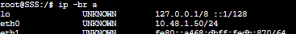
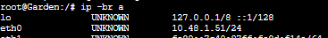
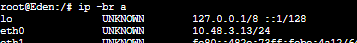
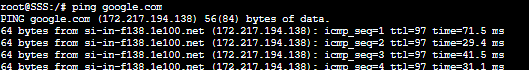
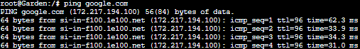
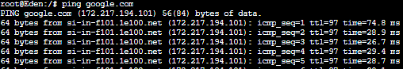

# Jarkom-Modul-3-ITB07-2022     
### Laporan Resmi Pengerjaan Sesi Lab Jaringan Komputer     
        

#### Nama Anggota Kelompok :      
1. 5027201004 Alda Risma Harjian 
2. 5027201042 Ilham Muhammad Sakti 
3. 5027201067 Naufal Ramadhan 

## Soal 1 dan 2:
Loid bersama Franky berencana membuat peta tersebut dengan kriteria WISE sebagai DNS Server, Westalis sebagai DHCP Server, Berlint sebagai Proxy Server, dan Ostania sebagai DHCP Relay.


#### JAWABAN
[ WISE ] -> DNS server
WISE sebagai DNS Server sehingga perlu melakukan install bind9
```
echo "nameserver 192.168.122.1" > /etc/resolv.conf
apt-get update
apt-get install bind9 -y
```

[ Berlint ] -> Proxy server

Berlint Sebagai Proxy server sehingga perlu melakukan install squid
```
echo "nameserver 192.168.122.1" > /etc/resolv.conf
apt-get update
apt-get install libapache2-mod-php7.0 -y
apt-get install squid -y
```
[ Ostania ] -> DHCP Relay

Ostania sebagai DHCP Relay sehingga perlu melakukan install isc-dhcp-relay
```
apt-get update
apt-get install isc-dhcp-relay -y
```
[ Wetalis ] -> DHCP Server

```
echo "nameserver 192.168.122.1" > /etc/resolv.conf
apt-get update
apt-get install isc-dhcp-server -y
```

Kami juga sudah membuat topologi


Untuk konfigurasi setiap nodenya adalah sebagai berikut

[ Ostania ]
```
auto eth0
iface eth0 inet dhcp

auto eth1
iface eth1 inet static
	address 10.48.1.1
	netmask 255.255.255.0

auto eth2
iface eth2 inet static
	address 10.48.2.1
	netmask 255.255.255.0

auto eth3
iface eth3 inet static
	address 10.48.3.1
	netmask 255.255.255.0
```

[ WISE ]
```
auto eth0
iface eth0 inet static
	address 10.48.2.2
	netmask 255.255.255.0
	gateway 10.48.2.1
```

[ Berlint ]
```
auto eth0
iface eth0 inet static
	address 10.48.2.3
	netmask 255.255.255.0
	gateway 10.48.2.1
```

[ Westalis ]
```
auto eth0
iface eth0 inet static
	address 10.48.2.4
	netmask 255.255.255.0
	gateway 10.48.2.1
```

Untuk Setiap Client yaitu Eden, NewstonCatle, KemonoPark menggunakan konfigurasi sebagai berikut untuk penerapan DHCP

[ NewstonCastle dan KemonoPark ]
```
auto eth0
iface eth0 inet static
	address 10.48.3.4
	netmask 255.255.255.0
	gateway 10.48.3.1
```

Terkecuali untuk CLient Eden konfigurasinya seperti berikut

[ Eden ]
```
auto eth0
iface eth0 inet dhcp
hwaddress ether 3e:96:21:e3:73:e3
```

### SOAL 3
Semua client yang ada HARUS menggunakan konfigurasi IP dari DHCP Server.
Client yang melalui Switch1 mendapatkan range IP dari [prefix IP].1.50 - [prefix IP].1.88 dan [prefix IP].1.120 - [prefix IP].1.15
#### JAWABAN
Konfigurasi DHCP Relay pada Fosha

[ Ostania ] -> DHCP Relay

Lakukan konfigurasi pada Ostania dengan melakukan edit file /etc/default/isc-dhcp-relay dengan konfigurasi berikut
```
# Defaults for isc-dhcp-relay initscript
# sourced by /etc/init.d/isc-dhcp-relay
# installed at /etc/default/isc-dhcp-relay by the maintainer scripts

#
# This is a POSIX shell fragment
#

# What servers should the DHCP relay forward requests to?
SERVERS="10.45.2.4"

# On what interfaces should the DHCP relay (dhrelay) serve DHCP requests?
INTERFACES="eth1 eth3 eth2"

# Additional options that are passed to the DHCP relay daemon?
OPTIONS=""

```

Konfigurasi DHCP Server pada Jipangu

[ Westalis ] -> DHCP Server

Membuat Westalis menjadi DHCP Server. Karena Westalis Terhubung dengan Ostania melalui eth0 sehingga lakukan konfigurasi pada file /etc/default/isc-dhcp-server sebagai berikut:

```
# Defaults for isc-dhcp-server initscript
# sourced by /etc/init.d/isc-dhcp-server
# installed at /etc/default/isc-dhcp-server by the maintainer scripts

#
# This is a POSIX shell fragment
#

# Path to dhcpd's config file (default: /etc/dhcp/dhcpd.conf).
#DHCPD_CONF=/etc/dhcp/dhcpd.conf

# Path to dhcpd's PID file (default: /var/run/dhcpd.pid).
#DHCPD_PID=/var/run/dhcpd.pid

# Additional options to start dhcpd with.
#       Don't use options -cf or -pf here; use DHCPD_CONF/ DHCPD_PID instead
#OPTIONS=""

# On what interfaces should the DHCP server (dhcpd) serve DHCP requests?
#       Separate multiple interfaces with spaces, e.g. "eth0 eth1".
INTERFACES="eth0"
```
Lakukan restart DHCP server dengan ```service isc-dhcp-server restart```
Setelah itu lakukan konfigurasi untuk rentang IP yang akan diberikan pada file  /etc/dhcp/dhcpd.conf dengan cara
```
subnet 10.48.2.0 netmask 255.255.255.0 {
}
subnet 10.48.1.0 netmask 255.255.255.0 {
    range  10.48.1.50 10.48.1.88;
    range  10.48.1.120 10.48.1.155;
    option routers 10.48.1.1;
    option broadcast-address 10.48.1.255;
    option domain-name-servers 10.48.2.2;
    default-lease-time 300;
    max-lease-time 6900;
}
```

### SOAL 4 
Client yang melalui Switch3 mendapatkan range IP dari [prefix IP].3.10 - [prefix IP].3.30 dan [prefix IP].3.60 - [prefix IP].3.85

### Jawaban Soal 4    
[Westalis]

Lakukan konfigurasi untuk rentang IP yang akan diberikan pada file  `/etc/dhcp/dhcpd.conf` dengan cara menambahkan konfigurasi berikut ini 
```
subnet 10.48.3.0 netmask 255.255.255.0 {
    range  10.48.3.10 10.48.3.30;
    range  10.48.3.60 10.48.3.85;
    option routers 10.48.3.1;
    option broadcast-address 10.48.3.255;
    option domain-name-servers 10.48.2.2;
    default-lease-time 600;
    max-lease-time 6900;
}
```
Dengan begitu kita telah menentukan ip range  dengan menambahkan `range  10.48.3.10 10.48.3.30;` dan `range  10.48.3.60 10.48.3.85;` pada subnet interface switch 3 yang terhubung ke Ostania pada eth3.

### Soal 5
Client mendapatkan DNS dari WISE dan client dapat terhubung dengan internet melalui DNS tersebut.

### Jawaban Soal 5
[Westalis]

Untuk client mendapatkan DNS dari WISE diperlukan konfigurasi pada file `/etc/dhcp/dhcpd.conf` dengan `option domain-name-servers 10.48.2.2;`

[WISE]

Supaya semua client dapat terhubung internet pada WISE diberikan konfigurasi pada file `/etc/bind/named.conf.options` dengan
```
echo "
options {
        directory \"/var/cache/bind\";
        forwarders {
                8.8.8.8;
                8.8.8.4;
        };
        // dnssec-validation auto;
        allow-query { any; };
        auth-nxdomain no;    # conform to RFC1035
        listen-on-v6 { any; };
};
"
```
### Testing
Dengan mengkonfigurasi DHCP server dan DHCP Relay seluruh Client yang berada pada subnet interface switch 1 dan switch 3 akan otomatis mendapatkan IP pada rentang yang telah dikonfigurasi. Untuk contohnya adalah sebagai berikut:

**SSS**



**Garden**



**Eden**



testing connect internet

**SSS**



**Garden**



**Eden**



### Soal 6
Lama waktu DHCP server meminjamkan alamat IP kepada Client yang melalui Switch1 selama 5 menit sedangkan pada client yang melalui Switch3 selama 10 menit. Dengan waktu maksimal yang dialokasikan untuk peminjaman alamat IP selama 115 menit.

### Jawaban Soal 6
Pada subnet interface switch 1 dan 3 ditambahkan konfigurasi berikut pada file `/etc/dhcp/dhcpd.conf`
```
subnet 10.48.1.0 netmask 255.255.255.0 {
    ...
    default-lease-time 360; 
    max-lease-time 7200;
    ...
}
subnet 10.48.3.0 netmask 255.255.255.0 {
    ...
    default-lease-time 720;
    max-lease-time 7200;
    ...
}
```

### Soal 7
Loid dan Franky berencana menjadikan Eden sebagai server untuk pertukaran informasi dengan alamat IP yang tetap dengan IP [prefix IP].3.13

### Jawaban Soal 7
Menambahkan konfigurasi untuk fixed address pada `/etc/dhcp/dhcpd.conf`
```
host Eden {
    hardware ethernet 3e:96:21:e3:73:e3;
    fixed-address 10.48.3.13;
}
```
Setelah itu tidak lupa untuk mengganti konfigurasi pada file `/etc/network/interfaces` dengan
```
auto eth0
iface eth0 inet dhcp
hwaddress ether be:c0:ff:37:bb:09
```

## *Kendala*
